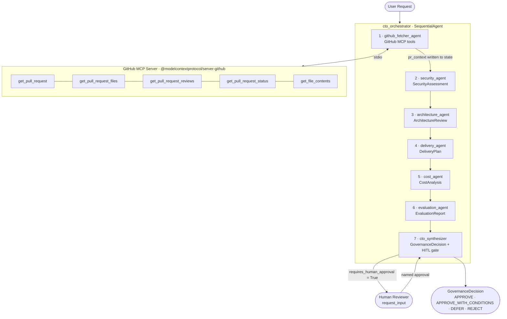

# Engineering Governance Agent

## Why This Project Matters

Engineering teams ship dozens of PRs per week, but CTOs and senior engineers can't manually review every change for security, architecture, cost, and delivery risk. Things fall through. Incidents happen. Cloud bills spike. Security audits fail.

This system acts as an always-on AI CTO that automatically reviews every code change across five critical dimensions before it merges:

| Dimension | Business Risk Avoided |
|---|---|
| **Security** | Prevents breaches, SOC2/GDPR/PCI-DSS violations, and credential leaks |
| **Architecture** | Catches scalability bottlenecks and design debt before they become production incidents |
| **Delivery** | Flags blocked PRs, failing CI, and deadline conflicts before they slip |
| **Cost** | Stops surprise cloud bill spikes — a single unreviewed DB upgrade can add $50k+/month |
| **Quality** | Enforces test coverage and blocks untested risky changes |

A single undetected security incident can cost millions in fines, remediation, and reputation damage. Cloud cost overruns from unreviewed infra changes are a top cause of engineering budget blowouts. The human-in-the-loop gate ensures high-stakes decisions (CRITICAL risk, budget impact) still get a named human sign-off — preserving accountability without creating a bottleneck on every PR.

This is a force multiplier for a small engineering team: CTO-level oversight on every merge without hiring a principal reviewer for every team. It scales governance linearly with PR volume at near-zero marginal cost.

---

An AI-powered CTO governance system built with [Google ADK](https://adk.dev/). It runs a sequential pipeline of seven agents: a GitHub data fetcher, five specialist reviewers, and a CTO synthesizer that produces a binding `GovernanceDecision`.

---

## Architecture

```
User request (GitHub PR URL or change description)
        │
        ▼
┌──────────────────────────────────────────────────────┐
│                 cto_orchestrator                     │
│              (SequentialAgent)                       │
│                                                      │
│  1. github_fetcher_agent → pr_context (session state)│
│        ↓ fetches PR, reviews, CI, file contents      │
│        ↓ all specialists read from {pr_context}      │
│                                                      │
│  2. security_agent     → SecurityAssessment          │
│  3. architecture_agent → ArchitectureReview          │
│  4. delivery_agent     → DeliveryPlan                │
│  5. cost_agent         → CostAnalysis                │
│  6. evaluation_agent   → EvaluationReport            │
│  7. cto_synthesizer    → GovernanceDecision          │
└──────────────────────────────────────────────────────┘
```



The `github_fetcher_agent` runs first and is the **only agent that calls GitHub**. It fetches PR metadata, the changed file list, review status, CI status, and the contents of up to 15 source files, then writes a structured `pr_context` report to session state. All five specialists read from `{pr_context}` — they have no tools and complete in a single LLM call each. The `cto_synthesizer` reads all five structured outputs and produces a final `GovernanceDecision` with an `overall_recommendation` of `APPROVE`, `APPROVE_WITH_CONDITIONS`, `DEFER`, or `REJECT`.

---

## Agents

### 1. `github_fetcher_agent`
**Role:** GitHub Data Collector  
**Tools:** `get_pull_request`, `get_pull_request_files`, `get_pull_request_reviews`, `get_pull_request_status`, `get_file_contents`  
**Output:** `pr_context` (plain-text report written to session state)

Runs first. Fetches all GitHub data needed for governance and writes a structured report to session state under the key `pr_context`. All downstream agents inject `{pr_context}` into their instructions and need no GitHub tools of their own.

What it fetches:
- PR title, description, author, state, labels, mergeable status
- Full list of changed files with additions/deletions
- Review decisions (approved / changes requested)
- CI check status (passing / failing)
- Contents of up to 15 source files (skips binaries and lock files)

If no GitHub PR URL is present in the request, writes a note to `pr_context` and all specialists return safe default assessments.

---

### 2. `security_agent`
**Role:** Senior Security Engineer  
**Tools:** None — reads `{pr_context}`  
**Output schema:** `SecurityAssessment`

Reviews the actual file contents from `pr_context` to identify security risks: hardcoded secrets, injection vulnerabilities (SQL/command/XSS), broken access control, insecure dependencies (CVEs), and compliance implications (SOC2, GDPR, PCI-DSS).

Severity levels: `CRITICAL` → `HIGH` → `MEDIUM` → `LOW`. Sets `requires_human_approval = True` if `overall_risk` is `HIGH` or `CRITICAL`, or if any individual finding is `CRITICAL`.

---

### 3. `architecture_agent`
**Role:** Principal Software Architect  
**Tools:** None — reads `{pr_context}`  
**Output schema:** `ArchitectureReview`

Reviews the actual file contents from `pr_context` to assess design quality: coupling, separation of concerns, missing abstractions, scalability bottlenecks (N+1 queries, missing caching, synchronous fan-out), and new dependency risks.

Verdicts: `APPROVED` / `APPROVED_WITH_CONCERNS` / `NEEDS_REWORK`. Sets `requires_human_approval = True` if verdict is `NEEDS_REWORK` or any concern is `HIGH` severity.

---

### 4. `delivery_agent`
**Role:** Engineering Delivery Manager  
**Tools:** None — reads `{pr_context}`  
**Output schema:** `DeliveryPlan`

Reads review decisions and CI status from `pr_context` to assess whether the PR is ready to ship. Identifies delivery risks: deadline conflicts, resource contention, dependency blockers, and rollback complexity.

Feasibility: `ON_TRACK` / `AT_RISK` / `BLOCKED`. Sets `requires_human_approval = True` if `BLOCKED` or any risk has `HIGH` probability.

---

### 5. `cost_agent`
**Role:** Cloud FinOps Engineer  
**Tools:** None — reads `{pr_context}`  
**Output schema:** `CostAnalysis`

Works from the PR description and file list using built-in cloud pricing knowledge. Identifies infrastructure resources being added or scaled (EC2, RDS, S3, Lambda, EKS) and estimates the monthly cost delta.

Impact levels: `NEGLIGIBLE` (<$50) / `LOW` ($50–$500) / `MEDIUM` ($500–$5k) / `HIGH` ($5k–$50k) / `CRITICAL` (>$50k). Sets `requires_human_approval = True` if `HIGH` or `CRITICAL`.

---

### 6. `evaluation_agent`
**Role:** Quality Engineering  
**Tools:** None — reads `{pr_context}`  
**Output schema:** `EvaluationReport`

Reads CI status and review decisions from `pr_context`. Inspects changed file paths and file contents to identify missing test files (unit, integration, e2e). Assesses regression risk based on scope of change and test coverage.

Quality gate: `PASS` / `CONDITIONAL_PASS` / `FAIL`. Sets `requires_human_approval = True` if gate is `FAIL` or review status is `NOT_REVIEWED` / `CHANGES_REQUESTED`.

---

### 7. `cto_synthesizer`
**Role:** Chief Technology Officer  
**Tools:** `request_input` (human-in-the-loop gate)  
**Output schema:** `GovernanceDecision`

Reads all five specialist assessments from session state, normalises their risk levels to a shared 4-level scale (`LOW` / `MEDIUM` / `HIGH` / `CRITICAL`), and applies deterministic recommendation rules:

| Rule | Condition | Recommendation |
|---|---|---|
| 1 | Any CRITICAL security finding | `REJECT` |
| 2 | Delivery BLOCKED or budget unavailable | `DEFER` |
| 3 | HIGH security/architecture risk, fixable CI failure | `APPROVE_WITH_CONDITIONS` |
| 4 | All risks LOW or MEDIUM | `APPROVE` |

If any specialist set `requires_human_approval = True`, the synthesizer calls `request_input` to pause and collect a named human decision before producing the final output.

---

## Usage

Send any of the following to the agent in the playground UI:

```
Review https://github.com/owner/repo/pull/42
```
```
KAN-1: Add Redis caching to the user-service API
```
```
We're migrating from db.t3.micro to db.r6g.4xlarge for the holiday season
```

The system detects change requests by keyword (`pr`, `pull`, `github`, `review`, `deploy`, …) and by ticket IDs matching `[A-Z]+-\d+` (e.g. `KAN-1`). Anything else is treated as a general chat query and skips the specialist pipeline.

**Tip:** Always include a GitHub PR URL. The `github_fetcher_agent` fetches actual file contents — without a PR URL it has nothing to fetch, and all specialist assessments will be superficial defaults.

---

## Setup

### Requirements

- Python 3.11+
- Node.js 22 LTS (for the GitHub MCP server — installed automatically in Docker)
- `uv` package manager
- A [Google AI Studio API key](https://aistudio.google.com/apikey) (starts with `AIza`)

### Install

```bash
agents-cli install
```

This installs Python dependencies via `uv` and pre-fetches the GitHub MCP npm package into `node_modules/` so the server starts without hitting the npm registry at runtime.

### Configure

Copy `app/.env.example` to `app/.env` and fill in:

```env
# Required
GEMINI_API_KEY=AIza...          # Google AI Studio key (NOT a Vertex AI key)
GOOGLE_GENAI_USE_VERTEXAI=false
GEMINI_MODEL=gemini-2.0-flash

# GitHub (for PR reviews)
GITHUB_PERSONAL_ACCESS_TOKEN=ghp_...

# Free-tier throttle (seconds between agents). Set to 0 on paid tiers.
INTER_AGENT_DELAY_SECONDS=12
```

### Run

```bash
agents-cli playground
```

Opens the ADK dev UI at `http://localhost:8080`.

---

## ADK Dev UI Guide

Run `agents-cli playground` and open `http://localhost:8080`. The **"Select an App"** dropdown at the top lists four modules:

### 1. `app` — the governance agent
This is the main module. Select it to interact with the `cto_orchestrator` pipeline.

- **Chat panel (left):** Send your change request here. The agent responds with the final `GovernanceDecision` JSON once all six agents complete. Expect ~90 seconds on the free tier due to the inter-agent throttle.
- **Events panel (right):** Streams every ADK event in real time. You will see 6 model calls per review (one per agent), tool calls showing which GitHub endpoints were hit and what they returned, and state mutations where each agent writes its structured output.
- **Sessions tab:** Lists all previous sessions. Click any session to replay its full trace — useful for debugging a failed run without re-running the pipeline.
- **Trace view:** Click the trace link at the bottom of any session to see the complete structured trace: all LLM inputs/outputs, tool call arguments and responses, and session state at each step.

### 2. `deployment` — deployment configuration
Shows the deployment metadata for this project: the Cloud Run service name, region, container image tag, and environment variable configuration. Use this module to verify what will be deployed before running `agents-cli deploy`. It reflects the values in `agents-cli-manifest.yaml` and the Terraform variables in `deployment/terraform/single-project/vars/env.tfvars`.

### 3. `node_modules` — MCP server packages
Shows the npm packages installed in `node_modules/` that serve as MCP (Model Context Protocol) servers. Currently this contains `@modelcontextprotocol/server-github`, the GitHub MCP server that provides the `get_pull_request`, `get_pull_request_files`, `get_pull_request_reviews`, and `get_pull_request_status` tools. Use this module to verify the MCP server binary is present and to inspect which version is installed. If the GitHub MCP server is missing, run `npm install` to restore it.

### 4. `tests` — eval and test suite
Provides an interface to run and inspect the agent's evaluation suite without leaving the browser. Shows the 5 labelled test cases from `tests/eval/datasets/governance_eval.json`, lets you run individual cases against the live agent, and displays the graded results against the criteria defined in `tests/eval/eval_config.yaml`. The same suite can be run from the terminal with `agents-cli eval run`.

---

## Project Structure

```
eng-governance/
├── app/
│   ├── agent.py                  # Root orchestrator, ADK patches, and callbacks
│   ├── agents/
│   │   ├── github_fetcher_agent.py  # Fetches all GitHub data once; writes pr_context
│   │   ├── security_agent.py        # Security risk assessment (reads {pr_context})
│   │   ├── architecture_agent.py    # Design and scalability review (reads {pr_context})
│   │   ├── delivery_agent.py        # PR readiness and delivery risk (reads {pr_context})
│   │   ├── cost_agent.py            # Infrastructure cost estimation (reads {pr_context})
│   │   ├── evaluation_agent.py      # CI, review status, test coverage (reads {pr_context})
│   │   └── _throttle.py             # asyncio.sleep callback between agents
│   ├── schemas/                  # Pydantic output schemas for all agents
│   │   ├── security.py           # SecurityAssessment
│   │   ├── architecture.py       # ArchitectureReview
│   │   ├── delivery.py           # DeliveryPlan
│   │   ├── cost.py               # CostAnalysis
│   │   ├── evaluation.py         # EvaluationReport
│   │   └── governance.py         # GovernanceDecision (final output)
│   ├── tools/
│   │   └── github_tools.py       # GitHub MCP toolset factory with per-agent filtering
│   └── .env                      # Local secrets (not committed)
├── node_modules/
│   └── @modelcontextprotocol/
│       └── server-github/        # Pre-fetched GitHub MCP server (avoids npx at runtime)
├── deployment/
│   └── terraform/
│       └── single-project/       # Terraform config for Cloud Run deployment
├── tests/
│   ├── unit/
│   │   └── test_dummy.py         # Placeholder — add unit tests here
│   ├── integration/
│   │   ├── test_agent.py         # Smoke test: agent produces text output
│   │   └── test_server_e2e.py    # End-to-end HTTP test against the running server
│   └── eval/
│       ├── eval_config.yaml      # Evaluation criteria and thresholds
│       └── datasets/
│           └── governance_eval.json  # 5 labelled test cases
├── Dockerfile                    # Container image for Cloud Run
├── package.json                  # GitHub MCP npm dependency
└── README.md
```

---

## Tests

### Unit tests
```bash
uv run pytest tests/unit
```
Placeholder directory — add fast, isolated tests here for schema validation, keyword detection logic, or callback functions.

### Integration tests
```bash
uv run pytest tests/integration
```
- `test_agent.py` — loads the full agent pipeline in-process and verifies it produces at least one text response for a general chat query. Does not require a running server.
- `test_server_e2e.py` — sends HTTP requests to a locally running `agents-cli playground` instance and verifies end-to-end SSE responses.

Requires `GEMINI_API_KEY` and `GITHUB_PERSONAL_ACCESS_TOKEN` to be set in `app/.env`.

### Eval tests
```bash
agents-cli eval run
```
Runs the agent against 5 labelled governance scenarios defined in `tests/eval/datasets/governance_eval.json`:

| Test case | What it validates |
|---|---|
| `low_risk_pr_approve` | Low-risk doc/comment PR → `APPROVE` |
| `critical_security_reject` | Public S3 bucket → `REJECT` with HITL gate |
| `high_cost_impact_defer` | Large RDS upgrade → `DEFER` or `APPROVE_WITH_CONDITIONS` |
| `blocked_delivery_defer` | Failing CI + changes requested → `DEFER` |
| `architecture_needs_rework` | Cross-service direct DB access → `NEEDS_REWORK` |

Eval criteria (defined in `eval_config.yaml`):
- All 5 specialist agents must be called (threshold: 0.9)
- HITL gate must fire when `requires_human_approval = True` (threshold: 0.85)
- Final output must be a complete `GovernanceDecision` (threshold: 0.9)
- Recommendations must match the risk evidence (threshold: 0.8)
- `CRITICAL` security findings must never produce bare `APPROVE` (threshold: 1.0)

---

## Deployment

### Local container

```bash
docker build -t eng-governance .
docker run -p 8080:8080 --env-file app/.env eng-governance
```

### Cloud Run (via Terraform)

```bash
gcloud config set project <your-project-id>
agents-cli deploy
```

Or provision the full infrastructure first:

```bash
agents-cli infra single-project   # Creates Cloud Run service, IAM, storage, telemetry
```

The Terraform configuration in `deployment/terraform/single-project/` sets up:
- Cloud Run service with the container image
- IAM bindings for the service account
- GCS bucket for session storage
- Cloud Trace and BigQuery telemetry exports

---

## Rate Limit Notes

This project makes 6 sequential LLM calls per governance review. On the Gemini API free tier:

| Key type | RPM | TPM | RPD |
|---|---|---|---|
| AI Studio (`AIza...`) | 15 | 1M | 1,500 |
| Vertex AI (`AQ...`) | 5 | 250k | 20 |

**Always use an AI Studio key.** Vertex AI keys have a 20 RPD cap — enough for only 3 full reviews per day.

`INTER_AGENT_DELAY_SECONDS` (default `12`) inserts a pause between agents to spread token usage across the 1-minute TPM window. Set it to `0` when using a paid API key or Vertex AI with billing enabled.

---

## Commands

| Command | Description |
|---|---|
| `agents-cli playground` | Launch local dev UI at `http://localhost:8080` |
| `agents-cli lint` | Run code quality checks |
| `agents-cli eval run` | Run all eval cases against the live agent |
| `uv run pytest tests/unit tests/integration` | Run unit and integration tests |
| `agents-cli deploy` | Deploy to Cloud Run |
| `agents-cli infra single-project` | Provision GCP infrastructure via Terraform |
